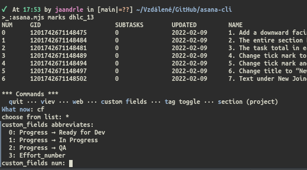
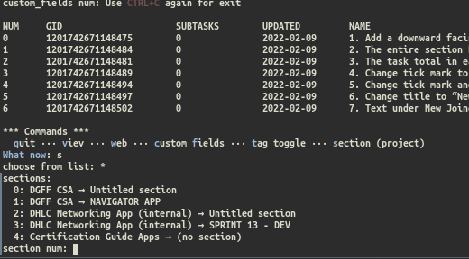
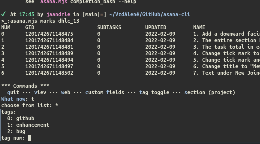
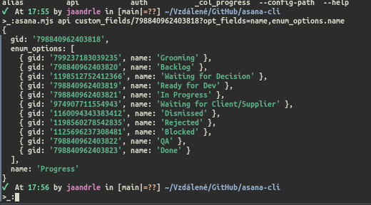
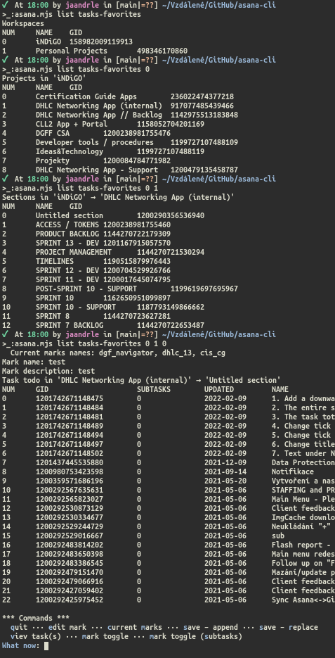

# asana-cli
For now, early version of application providing some actions from your terminal in “user friendly” way.

## Quick start
1. Install [nodejs](https://nodejs.org/en/download/) >= v16.13:
    ```bash
    curl -sL install-node.vercel.app/lts | bash
    ```
    …you can also use [nvm-sh/nvm: Node Version Manager](https://github.com/nvm-sh/nvm).
2. Download `asana.mjs` and make executable (or for run use `node asana.mjs` – Windows)
3. Run and folows instructions in: `asana.mjs auth`
4. Checks `asana.mjs list tags`, `asana.mjs list sections`, `asana.mjs list custom_fields`, and one of the `asana.mjs list tasks-*`
5. Run `asana.mjs marks *` (\* name defined in step 4)
6. if you not sure append `--help` for help

## Screenshots




<details><summary>big one</summary>


</details>

## Synopsis
```terminal
    asana.mjs@v2022-02-11: Utility to manage some actions with Asana tasks from command line.
    
    USAGE
        asana.mjs list [subcommands] [--help]
        asana.mjs marks [mark_name] [--help]
        asana.mjs api … [--help]
        asana.mjs alias [add|remove|list] [alias_name] [alias_value] [--help]
        asana.mjs [--help|--version|--config-path]
        asana.mjs auth [--help]
        asana.mjs completion_bash [--help|--complete]
        asana.mjs abbreviate [custom_fields|tags|list|--help] [add|remove|list] [alias_name] [alias_value]
    
    LIST|MARKS = USAGE OVERALL
        Asana tasks/projects/… are all in one pile. That means, if you try lists
        all projects/tags/… it can easily ends up with too big lists.

        So, working with this cli is splitted into three phases:
        1. You choose (pin) your typical projects (section), tags and custom fields via:
            `asana.mjs list [tags|custom_fields|sections] …`
        2. You choose (marked) tasks you want to work with (e. g. 'project1_urgent', 'project2_release2', …) via:
            `asana.mjs list [tasks-todos|tasks-favorites|tasks-all] …`
        3. Finally, you manage your tasks via:
            `asana.mjs marks mark_name`
        …see help for each via: `asana.mjs list|marks --help`
    
    API|ALIAS = SHORTEN LONG COMMAND / CUSTOM COMMANDS (WIP)
        You can create alias for any supported subcommands.
        With combination with api you can requests all
        Asana GET API (see https://developers.asana.com/docs/) and
        cerate your own functionality.

        Supports for PUT/POST/DELETE may be in future. Also for 'alias' support
        for argument placeholder may be added.
    
    COMMANDS COMPLETITION IN BASH
        see `asana.mjs completion_bash --help`
```
